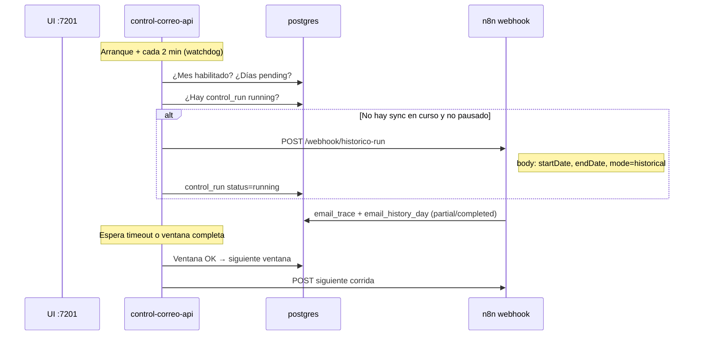

# Infraestructura total — telemetría n8n + control automático

Documento unificado: **stack Docker**, **webhook histórico**, y **ejecución automática**
desde el backend `control_correo` (sin lanzar `curl` a mano en cada corrida).

Relacionado: [infra/README.md](./infra/README.md) · [fase_0.md](./fase_0.md) ·
[estructura_program_control.md](./estructura_program_control.md) ·
[correos_historicos.md](./correos_historicos.md)

---

## Respuesta corta

| Pregunta | Respuesta |
|----------|-----------|
| ¿Debo llamar el webhook a mano en cada lote? | **No.** `control-correo-api` lo dispara solo vía HTTP interno. |
| ¿Debo importar y activar el workflow en n8n? | **Sí, una vez** (y de nuevo solo cuando cambies `workflow_ok.json`). |
| ¿Quién programa los días? | La UI **:7201** (`control_schedule`) + el **planner** del backend. |
| ¿Quién ejecuta n8n? | El **watchdog** del backend cada **2 min** (configurable). |

No hace falta repetir `POST …/webhook/historico-run` desde fuera del stack: eso ya lo hace
`N8nClient.trigger_historical()` cuando el scheduler está activo y la sync no está pausada.

---

## Qué es manual (una vez) vs automático (siempre)

### Manual — bootstrap inicial

1. Levantar Docker (`infra/docker compose up -d`).
2. Migraciones Postgres (`schema.sql`, `06-control-correo.sql`, etc.).
3. Credenciales en n8n: **Gmail OAuth** + **Postgres telemetria**.
4. **Importar** `workflow_ok.json` en n8n y **activar** el workflow (n8n 2.x: *Published* **y** *Active*).
5. Completar `infra/.env`: `N8N_API_KEY`, `N8N_WORKFLOW_ID` (recomendado), meses habilitados en UI.

### Automático — operación diaria

1. El backend arranca el **watchdog** al levantar `control-correo-api`.
2. Cada **2 min** evalúa si hay ventana pendiente y si no hay sync en curso.
3. Si toca procesar, hace **`POST http://n8n-telemetria:5678/webhook/historico-run`**
   con `{ mode, startDate, endDate }` (ventana de **2 días** según el planner).
4. n8n procesa **un lote** (hasta 10 correos por defecto) y termina.
5. El watchdog detecta que la ventana aún no está completa en `email_history_day` y,
   tras el **timeout** configurado, **reintenta** la misma ventana (siguiente lote o día).
6. Cuando los días de la ventana quedan `status = completed`, avanza a la siguiente ventana.

---

## Arquitectura completa

```
                    Internet / operador
                           │
         ┌─────────────────┼─────────────────┐
         │                 │                 │
         ▼                 ▼                 ▼
  ztrack.app/automatico   :7201 UI      Adminer :7901
  (proxy → n8n :7001)   control_correo
         │                 │
         ▼                 ▼
  ┌──────────────┐   ┌─────────────────────────────┐
  │ n8n-telemetria│◄──│ control-correo-api (:7200)  │
  │  workflow OK  │   │  • FastAPI REST               │
  │  webhook POST │   │  • APScheduler watchdog 2 min │
  └──────┬───────┘   │  • N8nClient → webhook/API    │
         │           └──────────────┬──────────────────┘
         │                          │
         └──────────┬───────────────┘
                    ▼
           ┌─────────────────┐
           │ postgres-telemetria │
           │  email_trace        │ ← n8n escribe matches
           │  email_history_day  │ ← n8n escribe avance día/lote
           │  control_*          │ ← backend escribe runs/estado
           └─────────────────┘
```

| Contenedor | Puerto host | Rol |
|------------|-------------|-----|
| `n8n-telemetria` | 7001 | Motor Gmail + workflow histórico |
| `control-correo-web` | 7201 | React + nginx → `/api` |
| `control-correo-api` | interno 7200 | Scheduler + cliente n8n |
| `postgres-telemetria` | interno | BD compartida |
| `adminer-telemetria` | 7901 | Consola SQL |

Red Docker: **`telemetria-net`**.

---

## Flujo automático (backend → n8n)



### Código relevante

| Pieza | Archivo | Función |
|-------|---------|---------|
| Disparo webhook | `control_correo/backend/app/services/n8n_client.py` | `trigger_historical()` |
| Ventanas 2 días | `control_correo/backend/app/services/planner.py` | `decide_window()` |
| Lanzamiento | `control_correo/backend/app/services/sync_manager.py` | `launch_window()`, `try_launch_next()` |
| Reloj | `control_correo/backend/app/services/scheduler.py` | `watchdog_tick()` cada N segundos |
| Arranque scheduler | `control_correo/backend/app/main.py` | `start_scheduler()` en lifespan |

El webhook recibe fechas **dinámicas**; el nodo **Config histórico API**
(`code-nodes/00c-webhook-config-historico.js`) las convierte en config del workflow.
No hace falta editar fechas en n8n en cada corrida.

---

## Configuración (`infra/.env`)

Copiar plantilla y completar:

```bash
cd infra
cp .env.example .env
```

### Variables críticas para automatización

| Variable | Default | Uso |
|----------|---------|-----|
| `TELEMETRIA_DB_PASSWORD` | — | Postgres (n8n + API) |
| `N8N_WEBHOOK_PATH` | `historico-run` | Path del nodo Webhook en n8n |
| `N8N_BASE_URL` | *(en compose)* `http://n8n-telemetria:5678` | URL interna Docker |
| `N8N_API_KEY` | vacío | API n8n (monitor + fallback) |
| `N8N_WORKFLOW_ID` | vacío | ID del workflow importado |
| `CONTROL_SCHEDULER_ENABLED` | `true` | `false` = sin auto-ejecución |
| `CONTROL_WATCHDOG_INTERVAL_SEC` | `120` | Pulso watchdog (**2 min**) |
| `CONTROL_EXEC_TIMEOUT_MIN` | `10` | Tiempo antes de reintento ventana |
| `PROGRAM_RANGE_START` | `2025-01-01` | Inicio calendario global |
| `PROGRAM_RANGE_END` | `2026-06-30` | Fin calendario global |

### Cómo obtener cada valor (paso a paso)

Trabaja sobre el archivo **`infra/.env`** (copia de `.env.example`). Tras editarlo,
recrea la API para que cargue las variables:

```bash
cd infra
docker compose up -d --force-recreate control-correo-api
```

---

#### 1. `N8N_WEBHOOK_PATH` — path del webhook histórico

**Qué es:** el último segmento de la URL del webhook de n8n (sin `/webhook/` delante).

**Valor en este proyecto:** `historico-run` (viene fijado en `workflow_ok.json`, nodo
**Webhook histórico**).

**Cómo confirmarlo en n8n:**

1. Abre `https://ztrack.app/automatico/` (editor n8n).
2. Abre el workflow **Telemetria - Trazabilidad de correos (OK)**.
3. Haz clic en el nodo **Webhook histórico**.
4. En parámetros busca **Path** → debe decir `historico-run`.

La URL de producción queda:

```text
https://ztrack.app/automatico/webhook/historico-run
```

Dentro de Docker (lo que usa `control-correo-api`):

```text
http://n8n-telemetria:5678/webhook/historico-run
```

**En `.env`:**

```env
N8N_WEBHOOK_PATH=historico-run
```

> Solo cambia este valor si modificaste el **Path** del nodo Webhook en n8n. Si importas
> `workflow_ok.json` sin tocar ese nodo, deja `historico-run`.

**Comprobar que el webhook está registrado** (workflow **activo**):

```bash
curl -sS "http://127.0.0.1:7001/webhook/historico-run"
```

Respuesta típica si está bien: HTTP 404 con texto *«Did you mean to make a POST request?»*
(el GET falla, pero el webhook **sí** existe). Si dice *«is not registered»*, activa el
workflow en n8n.

---

#### 2. `N8N_API_KEY` — clave de la API REST de n8n

**Qué es:** token para que `control-correo-api` pueda consultar workflows, comprobar si
están activos, cancelar ejecuciones colgadas y (como respaldo) lanzar el workflow por API.

**Cómo crearla en la UI de n8n:**

1. Entra a `https://ztrack.app/automatico/`.
2. Menú lateral → **Settings** (engranaje).
3. Sección **API** (o **n8n API**).
4. Pulsa **Create an API key** / **Create API Key**.
5. Pon una etiqueta (ej. `control-correo-prod`).
6. **Copia la clave en ese momento** — n8n no la vuelve a mostrar completa.

**En `.env`:**

```env
N8N_API_KEY=n8n_api_xxxxxxxxxxxxxxxxxxxxxxxxxxxxxxxx
```

(Sustituye por la clave real; sin comillas.)

**Comprobar que la clave funciona:**

```bash
curl -sS -H "X-N8N-API-KEY: TU_CLAVE_AQUI" \
  "http://127.0.0.1:7001/api/v1/workflows?limit=1"
```

Debe devolver JSON con `"data": [...]` y HTTP 200. Si devuelve 401, la clave es incorrecta
o expiró — crea otra.

> Sin `N8N_API_KEY` el backend **puede** disparar el webhook igual (opción mínima), pero
> la UI **Probar enlace n8n** no podrá verificar si el workflow está activo ni cancelar runs.

---

#### 3. `N8N_WORKFLOW_ID` — identificador del workflow importado

**Qué es:** el ID interno que n8n asigna al workflow **Telemetria - Trazabilidad de correos (OK)**
tras importarlo. El backend lo usa junto con la API key.

**Método A — desde la URL del editor (más rápido)**

1. Abre el workflow en n8n.
2. Mira la barra de direcciones del navegador. En n8n 1.x/2.x suele verse así:

```text
https://ztrack.app/automatico/workflow/AbCdEfGh12345678
                                      └──────────────┘
                                         N8N_WORKFLOW_ID
```

Copia solo el segmento después de `/workflow/` (letras y números, ~16–20 caracteres).

**Método B — desde la lista de workflows (sin API key)**

1. **Workflows** en el menú lateral.
2. Busca **Telemetria - Trazabilidad de correos (OK)**.
3. Menú `⋯` del workflow → a veces aparece **Copy link**; el id está en esa URL.

**Método C — con la API (recomendado si ya tienes `N8N_API_KEY`)**

En el servidor `161.132.53.51`:

```bash
export N8N_API_KEY="tu_clave"

curl -sS -H "X-N8N-API-KEY: ${N8N_API_KEY}" \
  "http://127.0.0.1:7001/api/v1/workflows" \
  | jq '.data[] | select(.name | test("Telemetria|Trazabilidad"; "i")) | {id, name, active}'
```

Ejemplo de salida:

```json
{
  "id": "xY7kL2mN9pQrStUv",
  "name": "Telemetria - Trazabilidad de correos (OK)",
  "active": true
}
```

Usa el campo **`id`**. Si `active` es `false`, activa el workflow en n8n antes de seguir.

**En `.env`:**

```env
N8N_WORKFLOW_ID=xY7kL2mN9pQrStUv
```

> **Importante:** cada vez que **borras y vuelves a importar** el workflow desde cero, n8n
> genera un **nuevo id**. Tras reimportar, repite este paso y actualiza `.env`.

**Comprobar id + clave juntos:**

```bash
curl -sS -H "X-N8N-API-KEY: ${N8N_API_KEY}" \
  "http://127.0.0.1:7001/api/v1/workflows/${N8N_WORKFLOW_ID}" \
  | jq '{id, name, active}'
```

---

#### 4. Ejemplo de bloque completo en `infra/.env`

```env
# ── n8n → control_correo (automatización histórico) ─────────────────────────
N8N_WEBHOOK_PATH=historico-run
N8N_API_KEY=n8n_api_xxxxxxxxxxxxxxxxxxxxxxxxxxxxxxxx
N8N_WORKFLOW_ID=xY7kL2mN9pQrStUv

CONTROL_SCHEDULER_ENABLED=true
CONTROL_WATCHDOG_INTERVAL_SEC=120
CONTROL_EXEC_TIMEOUT_MIN=10
```

`N8N_BASE_URL` **no** hace falta ponerlo en `.env` para Docker: `docker-compose.yml` ya
fija `N8N_BASE_URL=http://n8n-telemetria:5678` en el servicio `control-correo-api`.

---

#### 5. Verificación final desde la UI

1. Abre `http://161.132.53.51:7201`.
2. Pulsa **Probar enlace n8n**.
3. Debe mostrar algo como:
   - health OK
   - webhook OK
   - Workflow «Telemetria…» — **activo**
   - **overall OK**

Si falla el webhook pero la API responde, casi siempre falta **activar** el workflow en n8n
(no solo importarlo).

---

### Mínimo para que el backend dispare solo

**Opción A — solo webhook (más simple)**

```env
N8N_WEBHOOK_PATH=historico-run
CONTROL_SCHEDULER_ENABLED=true
```

Requisito: workflow **activo** en n8n (webhook de producción registrado).

**Opción B — webhook + API (recomendado en producción)**

```env
N8N_API_KEY=tu_api_key_de_n8n
N8N_WORKFLOW_ID=abc123...
N8N_WEBHOOK_PATH=historico-run
CONTROL_SCHEDULER_ENABLED=true
```

Ventajas extra:

- `GET /api/v1/runs/test-n8n` comprueba health, webhook y si el workflow está **activo**.
- Si el webhook responde 404, el cliente intenta **`POST /api/v1/workflows/{id}/run`** como respaldo.
- El watchdog puede **cancelar** ejecuciones colgadas vía API.

(Paso a paso para obtener cada variable: sección **Cómo obtener cada valor** más arriba.)

---

## Bootstrap n8n (una vez)

### 1. Importar workflow

1. Abrir `https://ztrack.app/automatico/` (o `http://161.132.53.51:7001/`).
2. **Workflows → Import from file** → `workflow_ok.json`.
3. Asignar credenciales **Gmail** y **Postgres telemetria** en los nodos que lo pidan.

Regenerar el JSON tras cambios en código:

```bash
python3 scripts/build-workflow-ok.py
```

### 2. Activar (obligatorio para webhook de producción)

En n8n **2.x**:

1. **Publish** el workflow.
2. Activar el toggle **Active** (no basta con publicar).

Sin esto aparece:

```text
webhook "POST historico-run" is not registered
```

Comprobar desde el servidor:

```bash
curl -sS -X POST 'http://n8n-telemetria:5678/webhook/historico-run' \
  -H 'Content-Type: application/json' \
  -d '{"mode":"historical","startDate":"2025-01-01","endDate":"2025-01-02","batchSize":10}'
```

Respuesta esperada: HTTP 200 (n8n acepta y ejecuta en segundo plano).

### 3. Activar vía API (opcional, scriptable)

Si ya tienes `N8N_API_KEY` y `N8N_WORKFLOW_ID`:

```bash
curl -sS -X PATCH "http://127.0.0.1:7001/api/v1/workflows/${N8N_WORKFLOW_ID}" \
  -H "X-N8N-API-KEY: ${N8N_API_KEY}" \
  -H "Content-Type: application/json" \
  -d '{"active": true}'
```

> n8n **no** importa workflows por API de forma trivial en todas las versiones; lo habitual
> sigue siendo import manual en UI **una vez**. La API sirve sobre todo para **activar**,
> **monitorizar** y **disparar** ejecuciones.

---

## Arranque del stack completo

```bash
cd infra

# 1. Entorno
cp .env.example .env   # editar passwords y N8N_*

# 2. Migraciones (BD ya existente)
docker exec -i postgres-telemetria psql -U telemetria_app -d telemetria \
  < ../infra/postgres/06-control-correo.sql

# 3. Levantar todo
docker compose up -d --build

# 4. Verificar
docker compose ps
curl -s http://127.0.0.1:7201/api/v1/dashboard | jq .
```

Tras importar y activar el workflow en n8n, el backend **lanzará la primera ventana solo**
al arrancar (si `CONTROL_SCHEDULER_ENABLED=true` y no está pausado).

---

## Programación (calendario y ventanas)

La automatización **no** usa el cron interno de n8n para el histórico. Usa:

| Capa | Qué decide |
|------|------------|
| **`control_schedule`** | Qué meses están habilitados (UI :7201) |
| **`planner.py`** | Primer día pendiente + ventana de **2 días** (`startDate`/`endDate` al webhook) |
| **`email_history_day`** | Qué días están `completed` (n8n escribe; lotes `partial` no cierran el día) |
| **`control_state.paused`** | Pausa global desde UI |

El webhook siempre recibe un rango corto, por ejemplo:

```json
{
  "mode": "historical",
  "startDate": "2025-03-10",
  "endDate": "2025-03-11"
}
```

Dentro de n8n, **Planificar días pendientes** elige el primer día del rango que aún no está
`completed` y **Sector lote** limita a **10 correos** por corrida (`batchSize` en Config o body).

---

## Tiempos del watchdog y lotes

Con sectores de 10 correos, **cada POST al webhook = una corrida corta** en n8n.

El backend marca un `control_run` como `running` hasta que:

- todos los días de la ventana están `completed` en `email_history_day`, **o**
- se alcanza **`CONTROL_EXEC_TIMEOUT_MIN`** (default **10 min**).

Si el día quedó `partial`, la ventana **no** está completa → tras el timeout el watchdog
hace **`retry_same`** y vuelve a llamar al webhook (siguiente lote).

| Ajuste | Efecto |
|--------|--------|
| Bajar `CONTROL_EXEC_TIMEOUT_MIN` a `3`–`5` | Más corridas/hora entre lotes (riesgo si un lote tarda) |
| Subir a `15` | Menos POSTs; más espera entre lotes |
| Pausar en UI | Detiene lanzamientos; n8n en curso puede cancelarse |

Intervalo real entre lotes ≈ **`max(timeout, duración del lote)`**, no el intervalo de 2 min
del watchdog (ese solo **evalúa** estado).

---

## Operación desde la UI (:7201)

| Acción | Endpoint | Efecto |
|--------|----------|--------|
| Ver progreso | `GET /api/v1/dashboard` | Días completados, ventana actual |
| Probar enlace n8n | `POST /api/v1/runs/test-n8n` | Health + webhook + workflow activo |
| Pausar auto | `POST /api/v1/runs/pause` | Watchdog no lanza más |
| Reanudar auto | `POST /api/v1/runs/resume` | Vuelve a lanzar ventanas |
| Sync manual fechas | `POST /api/v1/runs/trigger` | Solo si **pausado** |
| Reconciliar | `POST /api/v1/runs/reconcile` | Cierra runs huérfanos y relanza si toca |

Flujo operativo recomendado:

1. Bootstrap n8n + `.env` como arriba.
2. **Probar enlace n8n** en la UI hasta `overall_ok`.
3. Habilitar meses en calendario.
4. Dejar **Reanudado** (no pausado) → el backend trabaja solo.

---

## Diagnóstico rápido

| Síntoma | Causa habitual | Acción |
|---------|----------------|--------|
| 404 webhook not registered | Workflow inactivo | Activar en n8n (Publish + Active) |
| Dashboard `n8n_configured: false` | Falta webhook path o API+ID | Revisar `.env` |
| No avanza días | Sync pausada | UI → Reanudar |
| Día `partial` eterno | Lotes grandes / timeout corto | Subir timeout o bajar `batchSize` |
| Sin API monitor | `N8N_API_KEY` vacío | Opcional; webhook sigue funcionando |

Logs backend:

```bash
docker logs -f control-correo-api
```

Buscar: `Watchdog iniciado`, `Lanzada ventana`, `reintento automático`.

Consulta avance:

```sql
SELECT analyzed_date, status, emails_listed_count, emails_processed_count
FROM email_history_day
ORDER BY analyzed_date DESC
LIMIT 20;
```

---

## Resumen operativo

```
┌─────────────────────────────────────────────────────────────┐
│  UNA VEZ: Docker + migraciones + import workflow + ACTIVAR  │
│           + .env (N8N_* , scheduler enabled)                │
└─────────────────────────────────────────────────────────────┘
                              │
                              ▼
┌─────────────────────────────────────────────────────────────┐
│  AUTOMÁTICO: control-correo-api                           │
│    • watchdog cada 2 min                                  │
│    • POST interno → /webhook/historico-run                  │
│    • reintento ventana tras timeout                         │
│    • avance cuando email_history_day = completed            │
└─────────────────────────────────────────────────────────────┘
```

**No necesitas** ejecutar el webhook histórico manualmente en operación normal: eso es
responsabilidad del backend una vez configurado el entorno. Solo vuelves a n8n cuando
**actualizas** la lógica del workflow (`workflow_ok.json` + reimport + activar).
